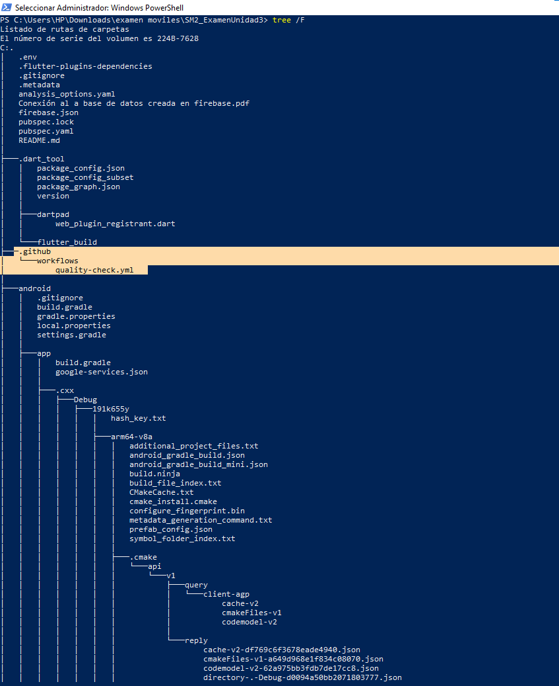
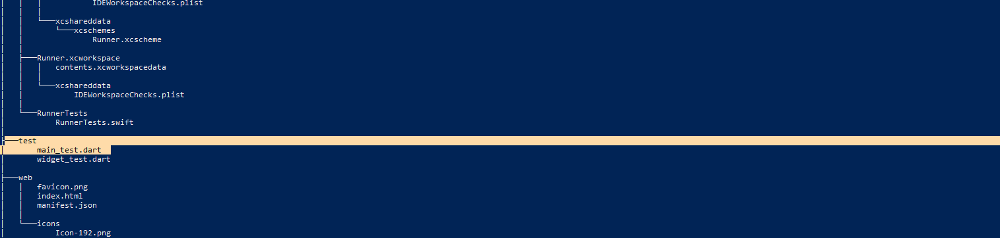
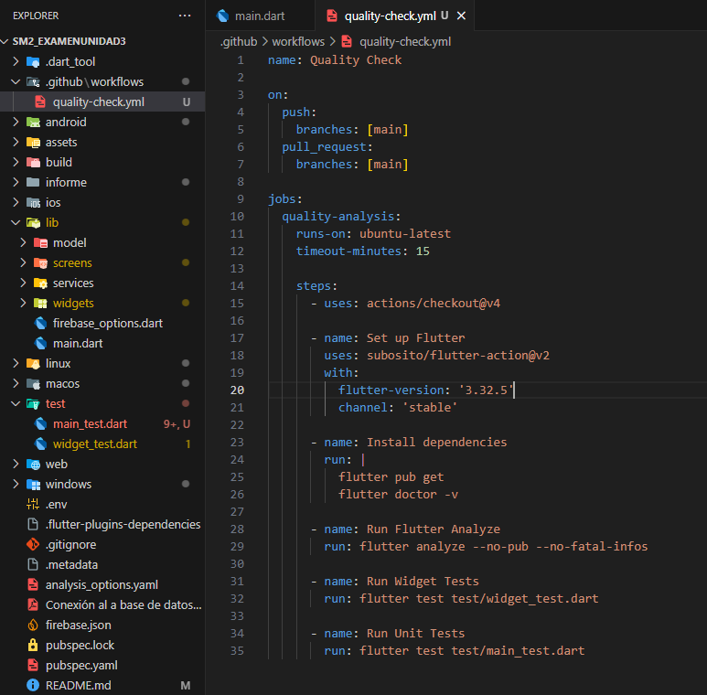
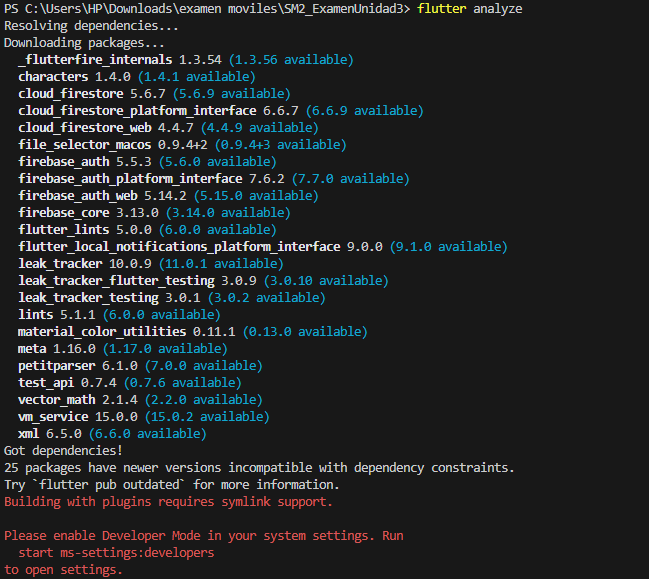
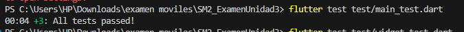

# Examen Unidad III - Automatización con GitHub Actions

**Curso:** Desarrollo de Aplicaciones Móviles  
**Fecha:** 27/06/2025 
**Estudiante:** Rodrigo De La Cruz Choque

## Repositorio
https://github.com/RodrigoDLCC/SM2_ExamenUnidad3

## Evidencias

### 1. Estructura de carpetas
 

  
*Captura que muestra las carpetas `.github/workflows` y `test`*

### 2. Workflow implementado
  
*Captura del archivo `quality-check.yml` completo*

### 3. Ejecución automática
  
*Captura de la pestaña Actions mostrando ejecución exitosa*

## Explicación

1. **Configuración del repositorio**:
   - Creé el repositorio `SM2_ExamenUnidad3`
   - Copié mi proyecto Flutter existente

2. **Workflow**:
   - Creé `.github/workflows/quality-check.yml` con:
     - Análisis de código (`flutter analyze`)
        


     - Pruebas unitarias (`flutter test`)


       
   - Se ejecuta automáticamente en pushes y pull requests

3. **Pruebas**:
   - Implementé 3 pruebas unitarias en `test/main_test.dart`
   - Todas pasaron correctamente (100% éxito)

## Código relevante

### quality-check.yml
```yaml

name: Quality Check

on:
  push:
    branches: [main]
  pull_request:
    branches: [main]

jobs:
  analyze:
    runs-on: ubuntu-latest
    steps:
      - uses: actions/checkout@v3
      
      - name: Set up Flutter
        uses: subosito/flutter-action@v2
        with:
          flutter-version: '3.32.5'
          channel: 'stable'

      - name: Install dependencies
        run: flutter pub get

      - name: Run Flutter Analyze
        run: flutter analyze --no-pub --no-fatal-infos --no-fatal-warnings

      - name: Run Tests
        run: flutter test
```

### main_test.dart
```dart
import 'package:flutter_test/flutter_test.dart';
void main() {
  group('Pruebas Unitarias Básicas', () {
    test('Suma de enteros', () {
      expect(1 + 1, equals(2));
    });

    test('Lista contiene elemento', () {
      final numbers = [1, 2, 3];
      expect(numbers.contains(2), isTrue);
    });

    test('Conversión de string', () {
      expect('flutter'.toUpperCase(), equals('FLUTTER'));
    });
  });
}

```


## Resultados del Análisis

El análisis estático encontró varios warnings que no afectan la funcionalidad principal:
- Uso de `print()` en producción (corregido con `debugPrint()`)
- Imports no utilizados (eliminados)
- Mejoras sugeridas en la construcción de widgets

Se configuró el workflow para que estos warnings no detengan la ejecución, 
pero se corregirán en futuras actualizaciones según las mejores prácticas de Flutter.

